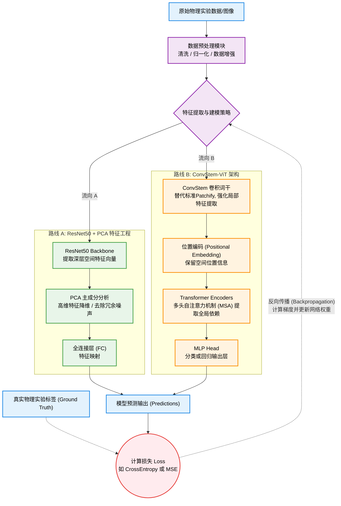

```mermaid
flowchart TD
    %% 样式定义
    classDef data fill:#e3f2fd,stroke:#1e88e5,stroke-width:2px,color:#000
    classDef process fill:#f3e5f5,stroke:#8e24aa,stroke-width:2px,color:#000
    classDef model_res fill:#e8f5e9,stroke:#43a047,stroke-width:2px,color:#000
    classDef model_vit fill:#fff3e0,stroke:#fb8c00,stroke-width:2px,color:#000
    classDef loss fill:#ffebee,stroke:#e53935,stroke-width:2px,color:#000

    %% 数据输入层
    Input["原始物理实验数据/图像"]:::data --> Preprocess["数据预处理模块<br>清洗 / 归一化 / 数据增强"]:::process
    
    %% 特征提取分流
    Preprocess --> Branch{"特征提取与建模策略"}:::process

    %% --- 路线 A: 传统深度学习降维路线 (resnet50_pca.py) ---
    subgraph RouteA ["路线 A: ResNet50 + PCA 特征工程"]
        ResNet["ResNet50 Backbone<br>提取深层空间特征向量"]:::model_res
        ResNet --> PCA["PCA 主成分分析<br>高维特征降维 / 去除冗余噪声"]:::model_res
        PCA --> ClassifierA["全连接层 (FC)<br>特征映射"]:::model_res
    end

    %% --- 路线 B: 前沿视觉大模型路线 (ConvStem-ViT) ---
    subgraph RouteB ["路线 B: ConvStem-ViT 架构"]
        ConvStem["ConvStem 卷积词干<br>替代标准Patchify, 强化局部特征提取"]:::model_vit
        ConvStem --> PosEmbed["位置编码 (Positional Embedding)<br>保留空间位置信息"]:::model_vit
        PosEmbed --> Transformer["Transformer Encoders<br>多头自注意力机制 (MSA) 提取全局依赖"]:::model_vit
        Transformer --> ClassifierB["MLP Head<br>分类或回归输出层"]:::model_vit
    end

    %% 将跨子图的连线移到子图外部定义，利用新版布局引擎优化连线路径，避免穿透标题
    Branch -->|"流向 A"| ResNet
    Branch -->|"流向 B"| ConvStem

    %% 预测与监督学习闭环
    ClassifierA --> Pred["模型预测输出 (Predictions)"]:::data
    ClassifierB --> Pred

    Label["真实物理实验标签 (Ground Truth)"]:::data -.-> LossFunc
    Pred --> LossFunc(("计算损失 Loss<br>如 CrossEntropy 或 MSE")):::loss

    %% 权重更新机制
    LossFunc -.->|"反向传播 (Backpropagation)<br>计算梯度并更新网络权重"| Branch
```
